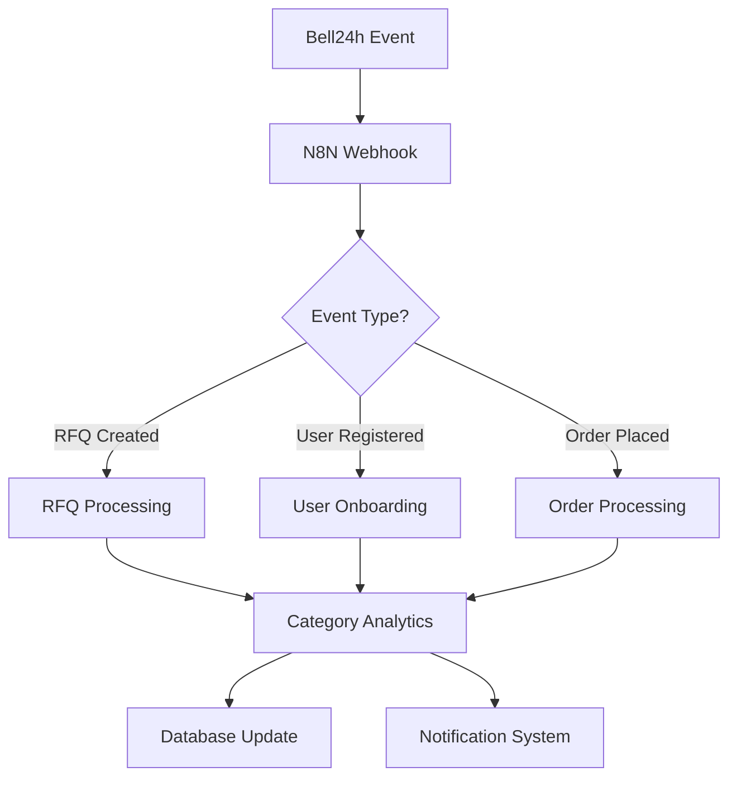
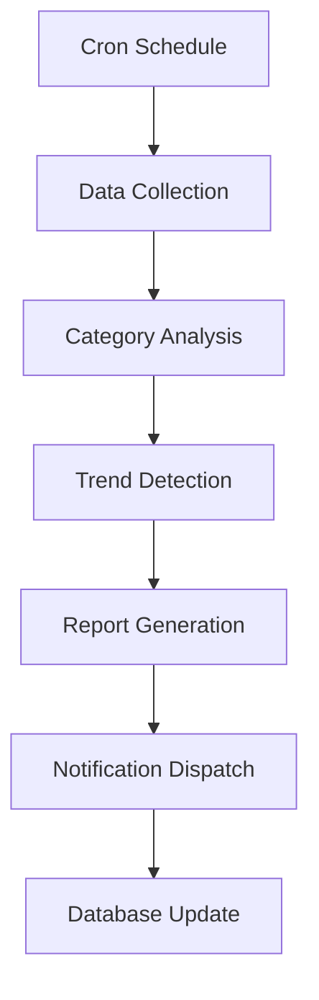
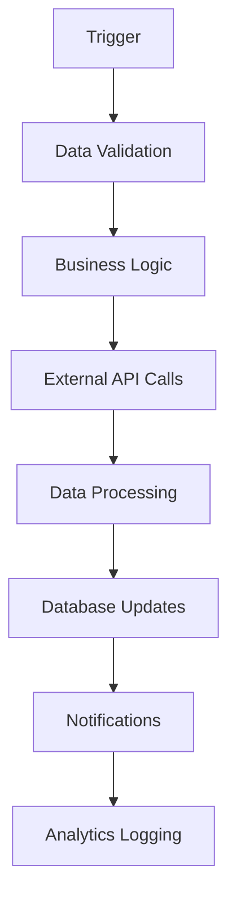

# 🤖 N8N Automation Strategy for Bell24h
## Complete Server Architecture & Workflow Recommendations

---

## 🎯 **CURRENT STATUS ANALYSIS**

### ✅ **What You Have:**
- **Basic N8N setup** with 4 workflow files
- **Webhook integration** for Bell24h events
- **Email automation** for user onboarding
- **RFQ notification** system
- **Analytics logging** capabilities

### ❌ **What's Missing:**
- **Production server configuration**
- **Category-specific automation**
- **Advanced workflow orchestration**
- **Integration with your 50 categories**
- **Scalable server architecture**

---

## 🏗️ **RECOMMENDED N8N SERVER ARCHITECTURE**

### **1. Server Types & Deployment Options**

#### **Option A: Dedicated N8N Server (Recommended)**
```yaml
Server Type: VPS/Cloud Instance
Specifications:
  - CPU: 2-4 cores
  - RAM: 4-8 GB
  - Storage: 50-100 GB SSD
  - OS: Ubuntu 20.04 LTS
  - Database: PostgreSQL (production) / SQLite (development)

Deployment Platforms:
  - DigitalOcean Droplet ($20-40/month)
  - AWS EC2 t3.medium ($30-50/month)
  - Google Cloud e2-medium ($25-45/month)
  - Railway.app ($5-20/month)
  - Render.com ($7-25/month)
```

#### **Option B: Containerized Deployment**
```yaml
Platform: Docker + Docker Compose
Benefits:
  - Easy scaling
  - Environment consistency
  - Easy backup/restore
  - Multi-service orchestration

Configuration:
  - N8N container
  - PostgreSQL container
  - Redis container (for caching)
  - Nginx reverse proxy
```

#### **Option C: Serverless/Managed (Advanced)**
```yaml
Platform: N8N Cloud / Self-hosted on Kubernetes
Benefits:
  - Auto-scaling
  - High availability
  - Managed infrastructure
  - Enterprise features

Cost: $50-200/month
```

---

## 🔧 **PRODUCTION N8N CONFIGURATION**

### **Environment Variables (.env)**
```bash
# N8N Core Configuration
N8N_BASIC_AUTH_ACTIVE=true
N8N_BASIC_AUTH_USER=admin@bell24h.com
N8N_BASIC_AUTH_PASSWORD=bell24h-n8n-2024-secure

# Database Configuration
DB_TYPE=postgresql
DB_POSTGRESDB_HOST=your-postgres-host
DB_POSTGRESDB_PORT=5432
DB_POSTGRESDB_DATABASE=n8n_production
DB_POSTGRESDB_USER=n8n_user
DB_POSTGRESDB_PASSWORD=secure-password

# Webhook Configuration
WEBHOOK_URL=https://n8n.bell24h.com
N8N_WEBHOOK_URL=https://n8n.bell24h.com

# Bell24h Integration
BELL24H_API_URL=https://www.bell24h.com/api
BELL24H_WEBHOOK_SECRET=bell24h-webhook-secret-2024
BELL24H_DATABASE_URL=your-database-url

# External Services
OPENAI_API_KEY=your-openai-key
MSG91_API_KEY=your-msg91-key
RAZORPAY_API_KEY=your-razorpay-key
SENDGRID_API_KEY=your-sendgrid-key

# Security
N8N_ENCRYPTION_KEY=your-32-char-encryption-key
N8N_JWT_SECRET=your-jwt-secret

# Performance
N8N_PAYLOAD_SIZE_MAX=16
N8N_METRICS=true
N8N_LOG_LEVEL=info
```

---

## 🚀 **ENHANCED WORKFLOW RECOMMENDATIONS**

### **1. Category-Specific Automation Workflows**

#### **A. Category Analytics Workflow**
```json
{
  "name": "Category Analytics Automation",
  "triggers": ["webhook", "schedule"],
  "functions": [
    "Track category performance",
    "Update trending categories",
    "Generate category reports",
    "Send analytics to admin"
  ],
  "integrations": [
    "Bell24h API",
    "Google Analytics",
    "Database queries",
    "Email notifications"
  ]
}
```

#### **B. Mock Order Generation Workflow**
```json
{
  "name": "Mock Order Generation",
  "triggers": ["schedule"],
  "functions": [
    "Generate realistic mock orders",
    "Update category statistics",
    "Create supplier notifications",
    "Update dashboard metrics"
  ],
  "schedule": "Every 6 hours"
}
```

#### **C. Category SEO Automation**
```json
{
  "name": "Category SEO Automation",
  "triggers": ["webhook", "schedule"],
  "functions": [
    "Update meta descriptions",
    "Generate keywords",
    "Create sitemap entries",
    "Submit to search engines"
  ],
  "integrations": [
    "Google Search Console",
    "Bing Webmaster Tools",
    "Sitemap generator"
  ]
}
```

### **2. User Engagement Workflows**

#### **A. User Onboarding Sequence**
```json
{
  "name": "Enhanced User Onboarding",
  "triggers": ["user.registered"],
  "steps": [
    "Send welcome email",
    "Create user profile",
    "Assign to relevant categories",
    "Send category recommendations",
    "Schedule follow-up email",
    "Track engagement metrics"
  ]
}
```

#### **B. RFQ Processing Automation**
```json
{
  "name": "RFQ Processing Pipeline",
  "triggers": ["rfq.created"],
  "steps": [
    "Validate RFQ data",
    "Categorize automatically",
    "Find matching suppliers",
    "Send notifications",
    "Track response rates",
    "Update category metrics"
  ]
}
```

### **3. Marketing Automation Workflows**

#### **A. Multi-Channel Marketing**
```json
{
  "name": "Multi-Channel Marketing",
  "triggers": ["schedule", "webhook"],
  "channels": [
    "Email campaigns",
    "WhatsApp Business",
    "SMS notifications",
    "Social media posts",
    "LinkedIn outreach"
  ],
  "integrations": [
    "SendGrid",
    "WhatsApp Business API",
    "MSG91",
    "LinkedIn API",
    "Facebook API"
  ]
}
```

#### **B. Lead Generation Automation**
```json
{
  "name": "Lead Generation Pipeline",
  "triggers": ["form.submitted", "rfq.created"],
  "steps": [
    "Qualify leads",
    "Assign to sales team",
    "Send follow-up sequences",
    "Track conversion rates",
    "Update CRM"
  ]
}
```

---

## 📊 **CATEGORY-SPECIFIC AUTOMATION STRATEGIES**

### **1. Agriculture Category Automation**
```yaml
Workflows:
  - Seasonal product recommendations
  - Weather-based supplier alerts
  - Crop cycle notifications
  - Government scheme updates
  - Market price alerts

Integrations:
  - Weather APIs
  - Government data APIs
  - Market price APIs
  - SMS/WhatsApp for farmers
```

### **2. Electronics Category Automation**
```yaml
Workflows:
  - Technology trend updates
  - Price drop notifications
  - New product launches
  - Technical specification updates
  - Warranty reminders

Integrations:
  - Product APIs
  - Price comparison APIs
  - Technical documentation
  - Customer support systems
```

### **3. Fashion Category Automation**
```yaml
Workflows:
  - Seasonal trend updates
  - Fashion week notifications
  - Inventory alerts
  - Style recommendations
  - Size guide updates

Integrations:
  - Fashion APIs
  - Trend analysis tools
  - Inventory management
  - Social media monitoring
```

---

## 🔄 **WORKFLOW ORCHESTRATION PATTERNS**

### **1. Event-Driven Architecture**


### **2. Scheduled Automation**


### **3. Multi-Step Workflows**


---

## 🛠️ **IMPLEMENTATION ROADMAP**

### **Phase 1: Basic Setup (Week 1)**
1. **Deploy N8N Server**
   - Set up VPS/cloud instance
   - Install N8N with PostgreSQL
   - Configure basic authentication
   - Set up SSL certificates

2. **Import Existing Workflows**
   - Deploy current 4 workflows
   - Test webhook integrations
   - Verify email functionality
   - Test database connections

### **Phase 2: Category Integration (Week 2)**
1. **Category Analytics Workflow**
   - Track category performance
   - Update trending categories
   - Generate category reports

2. **Mock Order Automation**
   - Automated mock order generation
   - Category statistics updates
   - Dashboard metric updates

### **Phase 3: Advanced Automation (Week 3-4)**
1. **User Engagement Workflows**
   - Enhanced onboarding sequences
   - Personalized recommendations
   - Follow-up campaigns

2. **Marketing Automation**
   - Multi-channel campaigns
   - Lead generation pipelines
   - Social media automation

### **Phase 4: Optimization (Week 5-6)**
1. **Performance Monitoring**
   - Workflow execution tracking
   - Error handling and alerts
   - Performance optimization

2. **Advanced Features**
   - AI-powered recommendations
   - Predictive analytics
   - Advanced reporting

---

## 💰 **COST ANALYSIS**

### **Server Costs (Monthly)**
```yaml
Development:
  - VPS: $10-20
  - Database: $5-10
  - Total: $15-30

Production:
  - VPS: $20-40
  - Database: $10-20
  - Monitoring: $5-10
  - Total: $35-70

Enterprise:
  - Managed N8N: $50-100
  - High-availability: $100-200
  - Advanced features: $50-100
  - Total: $200-400
```

### **Integration Costs (Monthly)**
```yaml
Email Services:
  - SendGrid: $15-50
  - Mailgun: $10-30

SMS Services:
  - MSG91: $10-30
  - Twilio: $15-40

API Services:
  - OpenAI: $20-100
  - Weather APIs: $5-20
  - Social Media APIs: $10-50
```

---

## 🔒 **SECURITY RECOMMENDATIONS**

### **1. Authentication & Authorization**
```yaml
- Enable basic authentication
- Use strong passwords
- Implement API key rotation
- Set up IP whitelisting
- Enable audit logging
```

### **2. Data Protection**
```yaml
- Encrypt sensitive data
- Use HTTPS for all communications
- Implement data retention policies
- Regular security updates
- Backup encryption
```

### **3. Network Security**
```yaml
- Use VPN for server access
- Implement firewall rules
- Monitor network traffic
- Regular security scans
- Incident response plan
```

---

## 📈 **MONITORING & ANALYTICS**

### **1. Workflow Monitoring**
```yaml
Metrics to Track:
  - Workflow execution time
  - Success/failure rates
  - Error frequency
  - Resource usage
  - Queue lengths
```

### **2. Business Metrics**
```yaml
KPIs to Monitor:
  - User engagement rates
  - Category performance
  - RFQ conversion rates
  - Email open rates
  - Automation ROI
```

### **3. Alerting System**
```yaml
Alerts for:
  - Workflow failures
  - High error rates
  - Resource exhaustion
  - Security incidents
  - Performance degradation
```

---

## 🚀 **IMMEDIATE ACTION PLAN**

### **Week 1: Setup**
1. **Deploy N8N server** on DigitalOcean/Railway
2. **Configure database** (PostgreSQL)
3. **Import existing workflows**
4. **Test basic functionality**

### **Week 2: Category Integration**
1. **Create category analytics workflow**
2. **Implement mock order automation**
3. **Set up category-specific notifications**
4. **Test with your 50 categories**

### **Week 3: Advanced Features**
1. **User engagement workflows**
2. **Marketing automation**
3. **Multi-channel notifications**
4. **Performance monitoring**

### **Week 4: Optimization**
1. **Error handling and alerts**
2. **Performance optimization**
3. **Security hardening**
4. **Documentation and training**

---

## 🎯 **SUCCESS METRICS**

### **Technical Metrics**
- **Workflow Uptime**: 99.9%
- **Execution Time**: <5 seconds average
- **Error Rate**: <1%
- **Response Time**: <2 seconds

### **Business Metrics**
- **User Engagement**: +25%
- **Category Performance**: +30%
- **RFQ Conversion**: +20%
- **Automation ROI**: 300%+

---

## 📞 **NEXT STEPS**

1. **Choose your server type** (VPS recommended)
2. **Deploy N8N server** with PostgreSQL
3. **Import and test** existing workflows
4. **Create category-specific** automation
5. **Implement monitoring** and alerts
6. **Scale based on** usage and performance

**Your N8N automation system will be the backbone of your Bell24h platform, handling everything from user onboarding to category management and marketing automation! 🚀**
